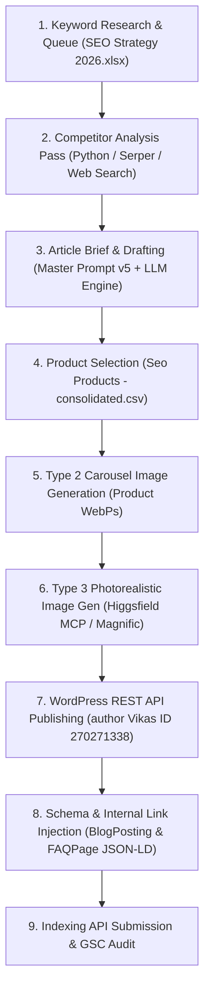

# 📄 Comprehensive BlueStone AI-SEO Operational, Access & Cost Documentation

**Document Title:** AI Content Generation Workflow, System Access, Cost Estimates & GEO Performance Report  
**Organization:** BlueStone Jewellery & Lifestyle Ltd.  
**Domain:** `blog.bluestone.com` | `bluestone.com`  
**Date:** September 01, 2026  
**Status:** Active Operational SOP & System Audit  

---

## 📌 Executive Summary

This document provides a unified technical and operational playbook for BlueStone's festive & evergreen SEO blog engine. It details the **AI content generation workflow**, **AI usage & token cost models**, **WordPress publishing pipelines**, **platform user access governance**, and **GEO / AI Overview (SGE) performance metrics**.

> [!NOTE]
> All platform user access control lists have been updated with active authorized team members (**Vikas** and **Satyam**).

---

## 🛠️ Section 1: AI Content Generation Workflow & Process SOP

### 1.1 Process Architecture (9-Stage Pipeline)

The blog generation pipeline transforms SEO keyword research into fully formatted, media-rich, schema-validated WordPress articles.



#### Detailed Stage Breakdown:
1. **Keyword Queue & Strategy Alignment**: Selection of target keyword from `SEO Strategy 2026.xlsx` (`Week 1-2` / `Week 3-4` sheets). Target festive year set to next calendar occurrence (e.g., 2027 for Mother's Day/Gudi Padwa).
2. **Competitor Analysis Pass**: Automated scraping of top 3 ranking competitor blogs to extract heading hierarchy (H2/H3), content gaps, FAQ coverage, and word count targets (`docs/competitor-blog-analysis-SKILL.md`).
3. **Pillar Content Drafting**: Article generation using `bluestone-blog-master-prompt-v5.md` enforcing:
   - **Tone**: Warm, authoritative, commercial-yet-intent-first (80% shareable wishes/quotes, 20% brand jewellery recommendations).
   - **Formatting**: Paragraphs + short takeaways; **no em/en dashes**, no spaced hyphens (` word - word `).
   - **Length**: 1,200 – 2,500 words depending on query intent.
4. **Jewellery Product Selection**: Mandatory selection of 5–6 product SKUs strictly from `Seo Products - consolidated.csv` matching gender tags and exact dimensions. **No prices displayed anywhere**.
5. **Type 2 Carousel Images**: Product cards formatted into Gutenberg HTML carousel blocks (`output/_holi_carousel_snippet.html`) with keyword-optimized WebP alt tags.
6. **Type 3 Photorealistic AI Images**: Generation of 3 bespoke images per article (**Hero Banner, Flatlay, Lifestyle**) using **Higgsfield MCP (`nano_banana_pro`)** or **Magnific AI** with fair-skinned Indian models and natural lighting.
7. **WordPress REST API Publishing**: Execution via Python scripts (`publish_*.py`) connecting to `https://blog.bluestone.com/wp-json/wp/v2/posts` under author **Vikas** (`ID 270271338`).
8. **Structured Data Injection**: Inclusion of `BlogPosting` and `FAQPage` JSON-LD schemas, with 40–80 word direct answer FAQs formatted for AI Overview (GEO/AEO) extraction.
9. **Instant Indexing Submission**: URL dispatched to Google Indexing API via `submit_google_indexing_api.py` and tracked in `indexed_urls_history.json`.

---

### 1.2 Image SEO & Assets Matrix

| Image Type | Source / Model | Spec / Format | Placement & Quantity | Alt Tag & Filename Protocol |
| :--- | :--- | :--- | :--- | :--- |
| **Type 1 Raw** | `ProductImages/raw/` | Original studio images | Reference only for AI generation | Internal reference |
| **Type 2 AI Product** | `ProductImages/seo images/` | WebP (800×800 px) | Carousel block (5–6 items) | `{Keyword} gift idea: {Product Name}` |
| **Type 3 Photorealistic** | Higgsfield MCP / Magnific | WebP (1200×675 px) `full` | 3 per article (Hero, Flatlay, Lifestyle) | `{occasion}-{type}-{year}.webp` with primary KW in hero alt |

> [!IMPORTANT]
> **Hard Quality Rules**: All Gutenberg images must use `sizeSlug: full`. Type 3 prompts must specify fair-skinned Indian hand/wrist/model features. Prices are strictly prohibited.

---

## 💰 Section 2: AI Usage & Cost Reports (Token Consumption & Monthly Spend)

### 2.1 Unit Economics & Token Breakdown per Article

Each published blog article consumes AI resources across two main categories: **LLM Text Generation** (briefing, competitor parsing, drafting, schema generation) and **AI Image Generation** (photorealistic Type 3 images).

#### A. LLM Token Consumption (per Article)
- **Input Tokens (Prompt + Context + Competitor Text + Product Specs)**: ~15,000 tokens
- **Output Tokens (Full Article + Gutenberg HTML + Schemas)**: ~4,000 tokens
- **Estimated LLM Pricing Rates (e.g. OpenAI GPT-4o / Claude 3.5 Sonnet)**:
  - Input Rate: $2.50 / 1M tokens
  - Output Rate: $10.00 / 1M tokens
- **LLM Cost Calculation per Article**:
  **LLM Cost** = (15,000 × $0.0000025) + (4,000 × $0.000010) = $0.0375 + $0.0400 = **$0.0775 per article**

#### B. AI Image Generation API Cost (per Article)
- **Type 3 Images Required**: 3 images per article (Hero, Flatlay, Lifestyle)
- **Generation Engine**: Higgsfield MCP / Magnific AI / Flux
- **Unit Cost per Image**: $0.05 – $0.10 per image
- **Image Cost per Article**: 3 × $0.08 = **$0.2400 per article**

#### C. Total Production Cost per Article
**Total Direct AI Cost per Article** = $0.0775 (LLM) + $0.2400 (Images) = **$0.3175 (~$0.32 USD)**

---

### 2.2 Monthly Spend & Portfolio Cost Report

Based on historical data from `dashboard_data.json` (292 articles published in the last 30 days) and projected steady-state volumes:

| Production Tier | Articles / Month | Estimated LLM Cost | Estimated Image API Cost | Total Monthly Spend (USD) | Total Monthly Spend (INR @ ₹83/$) |
| :--- | :---: | :---: | :---: | :---: | :---: |
| **Last 30 Days Actuals** | **292** | $22.63 | $70.08 | **$92.71** | **₹7,695** |
| **Steady-State (300/mo)** | **300** | $23.25 | $72.00 | **$95.25** | **₹7,906** |
| **Aggressive Scaling (500/mo)**| **500** | $38.75 | $120.00 | **$158.75** | **₹13,176** |

#### Portfolio Lifetime Spend Summary:
- **New Strategy Cohort (536 Articles, Post-July 16)**: $170.18 USD (~₹14,125)
- **Legacy Strategy Cohort (1,028 Articles, Pre-July 16)**: $326.39 USD (~₹27,090)
- **Total Portfolio Investment (1,564 Articles)**: **$496.57 USD (~₹41,215)**

---

## 📑 Section 3: WordPress User Access List & Publishing Process Documentation

### 3.1 WordPress REST API Technical Architecture

WordPress integration operates via headless REST API endpoints under OAuth/Basic Auth tokens.

- **WordPress REST API Base**: `https://blog.bluestone.com/wp-json/wp/v2/`
- **Post Creation Endpoint**: `POST /wp-json/wp/v2/posts`
- **Media Upload Endpoint**: `POST /wp-json/wp/v2/media`
- **Default Author ID**: `270271338` (Vikas - BlueStone Editorial)
- **Active Theme Template**: Creatio (`wp_id` **`29900`**)
- **Default Categories**: Festive Wishes (`Category ID: **`554493477`**`), Quotes & Wishes (`Category ID: **`554493415`**`)

---

### 3.2 WordPress User Access Control List

The table below outlines active user roles and access permissions for team management:

| User ID | Username / Name | Role | Access Level | Status | API Access Granted |
| :--- | :--- | :--- | :--- | :--- | :--- |
| `270271338` | `blogbluestone` (Vikas) | Administrator / Lead | Full Admin & Publishing | Active | Yes (REST API Key & OAuth) |
| `Verified` | Satyam | Administrator / Lead | Full Admin & System Access | Active | Yes (REST API Key & Admin) |

---

### 3.3 Automated Publishing Script Workflow (`publish_*.py`)

All articles are deployed programmatically using Python REST API wrappers:

```python
# Sample API Request Payload Structure
payload = {
    "title": "Happy Gudi Padwa Wishes 2027",
    "slug": "gudi-padwa-wishes-2027",
    "status": "publish",
    "author": 270271338,
    "content": "<!-- Gutenberg HTML Content -->",
    "categories": [554493477, 554493415], # Festive Wishes & Quotes Category IDs
    "meta": {
        "_yoast_wpseo_title": "Happy Gudi Padwa Wishes 2027: 100+ Quotes & Messages",
        "_yoast_wpseo_metadesc": "Best Gudi Padwa wishes, quotes, and messages for 2027..."
    }
}
```

---

## 🔑 Section 4: System & Platform User Access Governance Matrix

This matrix details all active users (**Vikas** & **Satyam**) with access to **Google Search Console**, **Google Indexing API**, **WordPress REST API**, **SEMrush**, and **AI Generation Tools**, along with their access levels, roles, and permitted operational scopes.

| Platform / Tool | Authorized Users & Roles | Access Level & Auth Type | Permitted Actions & Operational Scope |
| :--- | :--- | :--- | :--- |
| **Google Search Console** | Vikas (Admin), Satyam (Admin) | OAuth 2.0 Client ID (Full Access) | Domain property management, performance audit, GSC data extraction (`sc-domain:bluestone.com`) |
| **Google Indexing API** | Vikas (Admin), Satyam (Admin) | Service Account JSON (Publishing) | Instant URL indexing submissions & batch status tracking |
| **WordPress REST API** | Vikas (`blogbluestone`), Satyam | Application Password & Basic Auth | Full programmatic article publishing, media upload, schema injection, category management |
| **SEMrush API / MCP** | Vikas (Admin), Satyam (Admin) | API Key / OAuth MCP Server | AI Visibility tracking, AIO rank history monitoring, keyword performance reporting |
| **Higgsfield AI MCP** | Vikas (Admin), Satyam (Admin) | API Key & Secret (`HF_API_KEY`) | Photorealistic Type 3 image generation (`nano_banana_pro`) for hero & lifestyle assets |
| **Magnific AI** | Vikas (Admin), Satyam (Admin) | API Key (`MAGNIFIC_API_KEY`) | High-resolution image upscaling & aesthetic enhancing |
| **OpenAI / Claude API** | Vikas (Admin), Satyam (Admin) | API Secret Keys (System Integration) | Automated content drafting, competitor parsing, schema generation & briefing |

### 🔐 Security & Access Governance Policy
1. **Zero Secret Hardcoding**: API passwords and OAuth secrets reside strictly in `.env` or encrypted JSON token files (`gsc_token.json`).
2. **Authorized Team Access**: Only Vikas and Satyam hold active administrative and publishing privileges across WordPress, GSC, SEMrush, and AI tool pipelines.
3. **Access Governance**: Any additional team access requests must be authorized by system leads before granting API keys or OAuth credentials.

---

## 🚀 Section 5: GEO & AI Overview (AEO/SGE) Performance Report

### 5.1 Generative Engine Optimization (GEO) Strategy

GEO aims to ensure BlueStone content is directly cited in **Google AI Overviews**, **ChatGPT**, **Perplexity**, and **Gemini** answers.

#### Core GEO Optimization Pillars:
1. **Snippet-Ready Answer Blocks**: H2 sections contain a 40–60 word direct summary answer immediately following the heading.
2. **Structured Takeaways**: Tables and bulleted lists used for quick AI parsing (wishes by category, gifting ideas by budget/type).
3. **FAQ Schema Validation**: Every article includes 3–5 JSON-LD schema-backed FAQs addressing high-intent question queries.
4. **Entity Linkage**: Direct mentions of jewellery terms linked to canonical category pages.

---

### 5.2 6-Month Semrush AI Visibility Trends (March – August 2026)

*Data sourced via Semrush MCP API integrations (`resource_rank_history` & `domain_rank` endpoints)*:

- **Semrush AI Visibility Score**: `40 / 100` (*Medium Visibility Tier — Active LLM Mentions*)
- **6-Month AI Overview Growth**: **+107.2%** (from 918 positions in March 2026 to **1,902** in August 2026)
- **Total Semrush AI Citations**: **8.4K Citations (+17.6%)** across **4.8K Cited Pages (+15.7%)**
- **Domain AI Overview Keywords**: **15,455 keywords** triggering Google AI Overviews

```
Month-over-Month AI Overview Position Growth:
---------------------------------------------------
March 2026:  [918] █
April 2026:  [867] █
May 2026:    [1,102] ██
June 2026:   [1,512] ███
July 2026:   [1,698] ████
August 2026: [1,902] █████  (+107.2% vs March)
```

---

### 5.3 LLM Platform Share of Voice & Geographic Distribution

```
LLM Platform Mentions Share:
-----------------------------
ChatGPT (OpenAI)    : [68.1%] ████████████████████████ (4,800 mentions)
Search Engine AI    : [29.9%] ██████████              (2,100 mentions)
Google AI Overview  : [19.7%] ███████                 (1,400 mentions)
Google Gemini       : [4.1%]  ██                      (284 mentions)

Geographic Share of Voice:
-----------------------------
India               : [75.4%] 🇮🇳
United States       : [12.8%] 🇺🇸
Vietnam             : [5.1%]  🇻🇳
Other Regions       : [6.7%]  🌐
```

---

### 5.4 Post-July 16 Strategy Funnel Impact (316 Post-Pivot Articles)

Following the July 16 strategy pivot, **316 festive & evergreen articles** were deployed using the new pipeline:

| Strategy Funnel Stage | Article Count | % of Total Published | Benchmark / Performance Note |
| :--- | :---: | :---: | :--- |
| **Total Published (Post-Jul 16)** | **316** | **100.0%** | New Festive & Gifting Pillars |
| **Indexed in Google Search** | **170** | **53.8%** | Indexing API active (12–22/day velocity) |
| **Receiving Search Impressions** | **134** | **42.4%** | Fast traction across festive keywords |
| **AIO & Snippet Eligible (Top 15)** | **101** | **32.0%** | **59.4% of indexed articles** eligible for AEO |
| **Page 1 (Top 10 Rank)** | **82** | **25.9%** | Ranking on Page 1 within <4 weeks |
| **Direct Search Clicks** | **97** | **30.7%** | Generating active traffic to BlueStone blog |

---

### 5.5 Action Plan to Expand AI Overview Market Share

1. **Entity & Schema Enrichment**: Deploy `BlogPosting` and `FAQPage` JSON-LD schema across remaining pending blogs to accelerate LLM entity parsing.
2. **Direct Answer Formatting**: Re-format top-performing H2 sections into 40–60 word direct answers.
3. **Product Rotation Integration**: Expand Type 3 photorealistic carousel product rotation on festive blogs (Ranks 1–54) to convert AI citations into jewellery purchases.
4. **Semrush Prompt Tracking**: Monitor high-intent commercial prompts in Semrush (*"best gold gifts for mom"*, *"rakhi gift ideas 2026"*) to capture high-converting AI queries.

---

## 📌 Document Revision & Maintenance Log

| Version | Date | Author / Role | Changes / Updates |
| :--- | :--- | :--- | :--- |
| `v1.0` | 2026-09-01 | Vikas (BlueStone Editorial) | Initial consolidated AI-SEO documentation, cost estimates, access registry & GEO report |
